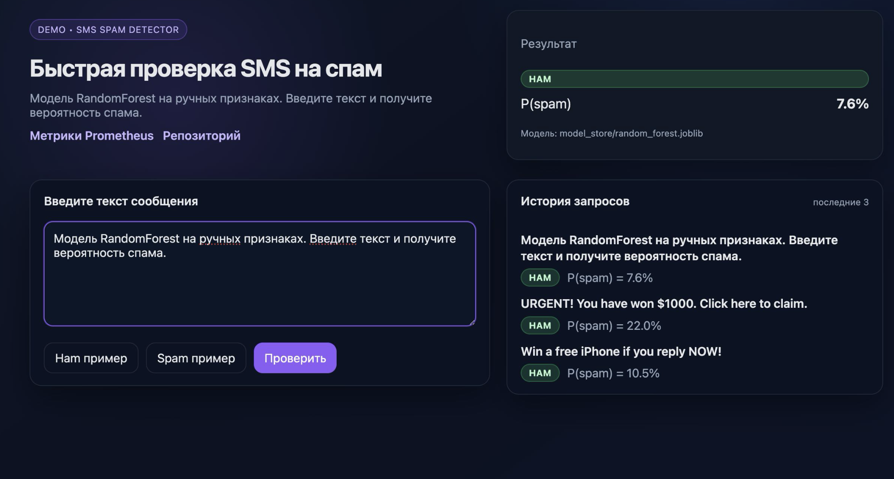

# SMS Spam Detector — учебный MLOps стек



Это демо, как собрать весь жизненный цикл модели для антиспама на SMS: от сырых сообщений до сервиса с мониторингом. Задача — классифицировать входящий текст на `spam`/`ham`, построив простые интерпретируемые признаки, обучив модель и развернув её с метриками и CI/CD. Репозиторий демонстрирует, как связать данные, Feature Store, обучение, проверку качества, API, мониторинг и доставку в одно целое, чтобы можно было воспроизводимо получать и обновлять модель.

Презентация: [MLOps.pdf](presentation/MLOps.pdf).

Основные фишки (из презентации):
- end-to-end пайплайн: download → preprocess → Feast apply/materialize → train → evaluate → register → serve;
- согласованность фичей оффлайн/онлайн (Feast) и контроль качества перед выкладкой (порог ROC-AUC);
- наблюдаемость: метрики Prometheus (`request_count`, `latency`, `prediction_proba_spam`) + готовый дашборд Grafana;
- лёгкий фронтенд `/ui` на React без сборки: ввод SMS, история запросов, показ P(spam), ссылки на метрики;
- CI/CD через GitHub Actions (pytest → build/push GHCR → `kubectl set image`) и манифесты Kubernetes/HPA.

Проект показывает полный путь от подготовки данных до продового сервиса с мониторингом:
- предобработка SMS и простые текстовые признаки;
- обучение RandomForest и хранение артефактов;
- REST API на FastAPI с фронтом `/ui` и метриками Prometheus;
- Feature Store на Feast для согласованности фичей;
- мониторинг Prometheus + Grafana;
- CI/CD (GitHub Actions) и K8s манифесты.

## Фронтенд
- Отдаётся из `static/` на маршруте `/ui` (FastAPI StaticFiles), React 18 из CDN без сборки.
- Возможности: ввод текста, подсказки спам/хам, сохранение последних запросов (до 8), показ вероятности `P(spam)` и имени файла модели, ссылки на `/metrics` и репозиторий.
- Стили и сетка в `static/style.css`, логика — `static/app.js`, точка входа — `static/index.html`.

## Что внутри репозитория
- `src/`: скрипты `download_data`, `preprocess`, `train`, `evaluate`, `register`, `api`, `drift_check`.
- `feature_repo/`: конфигурация Feast (offline/online store), описания entity/feature view.
- `model_store/`, `reports/`: артефакты моделей и метрик (игнорируются в git).
- `docker-compose.yaml`: API + Prometheus + Grafana.
- `docker-compose.feast.yaml`: one-shot пайплайн (download → preprocess → feast apply/materialize → train).
- `k8s/`: Deployment/Service/HPA для кластера.
- `.github/workflows/`: CI (pytest) и CD в кластер.

## Минимальный локальный запуск
```bash
python3 -m venv .venv
source .venv/bin/activate
pip install --upgrade pip
pip install -r requirements.txt

python src/download_data.py
python src/preprocess.py
cd feature_repo && feast apply && feast materialize 2020-01-01 2020-12-31 && cd ..
python src/train.py

MODEL_DIR="$PWD/model_store" MODEL_FILENAME="random_forest.joblib" \
uvicorn src.api:app --host 127.0.0.1 --port 8080
```
Проверка: `curl http://127.0.0.1:8080/health` и UI на `http://127.0.0.1:8080/ui`.

## Запуск в Docker
- Простой стек (API + метрики + дашборд):
  ```bash
  docker compose up --build -d
  ```
  UI: `http://localhost:8080/ui`, Prometheus: `http://localhost:9090`, Grafana: `http://localhost:3000` (admin/admin).
  При необходимости укажите задержку запросов: `SIMULATED_LATENCY_SEC=0.5 docker compose up --build -d`.

- One-shot пайплайн с Feast и обучением:
  ```bash
  docker compose -f docker-compose.feast.yaml up --build
  ```
  После завершения контейнер остановится; артефакты будут в `model_store/`, `reports/`, `feature_repo/data/`.

## Тесты и отладка
- Юнит-тесты: `pytest -q`
- Мониторинг: метрики на `/metrics`, кастомные `request_count`, `request_latency_seconds`, `prediction_proba_spam_bucket`.
- Проверка модели: `python src/evaluate.py` (отчёт в `reports/eval.json`, используется в регистрации).

## Деплой (кратко)
- CI/CD: `.github/workflows/deploy.yml` — pytest → build/push GHCR → `kubectl set image`.
- K8s: `k8s/deployment.yaml`, `k8s/service.yaml`, `k8s/hpa.yaml`; образ ожидается `ghcr.io/<owner>/spam-api:latest`.
- Secrets: `KUBE_CONFIG_DATA` (base64 kubeconfig) в GitHub Actions; GHCR использует `GITHUB_TOKEN`.

## Полезные пути/переменные
- Модель по умолчанию: `model_store/random_forest.joblib`, переопределяется `MODEL_DIR` и `MODEL_FILENAME`.
- Отчёт метрик: `reports/eval.json`.
- Зарегистрированная модель: `model_store/production/random_forest.joblib` (скрипт `src/register.py`).
